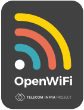
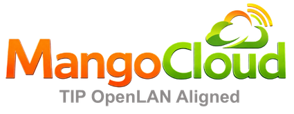

<p align="center">
  
  &nbsp;&nbsp;&nbsp;&nbsp;&nbsp;&nbsp;&nbsp;&nbsp;&nbsp;&nbsp;&nbsp;&nbsp;
  
</p>

# OpenWiFi Provisioning UI (OWPROV-UI)

## Overview
The OpenWiFi Provisioning UI (OWPROV-UI) is the official web management interface for the Provisioning Service (`owprov`) within the Telecom Infra Project (TIP) OpenWiFi CloudSDK (OWSDK) ecosystem.

OWPROV-UI provides a comprehensive React-based dashboard for network administrators to define entity hierarchies, assign venues, configure device policies, manage templates, and monitor provisioning states. To run the interface, you can set it up locally for [development](#development) or compile it for [production](#production).

## Role in Mango Cloud
This service is part of [Mango Cloud](https://www.mangowifi.cloud/), Router Architects’ open-source platform for managed Wi-Fi and connectivity operations.

Within Mango Cloud, **OWPROV-UI** serves as the **Provisioning Operator Web Console** (integrated into the primary management dashboard).

Key integrations include:
* **Provisioning Control Panel**: Interacts with the Provisioning REST API (`owprov` port `16005`) to visually construct logical entity structures (e.g. MDU properties, floors, rooms).
* **Security & Auth Integration**: Authenticates operators and signs requests via the Security Service (`owsec` port `16001`), utilizing JWT tokens.
* **Device Association Visualizer**: Allows administrators to claim access points and mesh nodes, assign them to venues or entities, and review computed configurations.

### Resources
* [Mango Cloud Website](https://www.mangowifi.cloud/)
* [Mango Cloud Deployment Guide](https://github.com/routerarchitects/mango-cloud-deployment)
* [Router Architects GitHub Organization](https://github.com/routerarchitects)

### Provisioning Guides
* [Provisioning Model Overview](https://www.mangowifi.cloud/docs/operations/provisioning-hierarchy-owprov/provisioning-model-overview)
* [End-to-End Provisioning Workflow](https://www.mangowifi.cloud/docs/operations/provisioning-hierarchy-owprov/provisioning-workflow-end-to-end)

## Key Features
The Provisioning Console provides a unified interface for the following operations:
* **Hierarchical Tree Management**: Visual tree builder to map organizations, entities, and child venues recursively (Entity and Venue pages).
* **Inventory Control & Claiming**: Register new Access Points via Serial Number / MAC Address, associate them with entities or venues, and manage device ownership.
* **Flexible Device Configuration**: Edit and compose reusable configuration templates (SSIDs, raw JSON configurations, device rules, and firmware preferences).
* **Interactive Coverage Mapping**: Integrates with Google Maps to show geographically distributed venues, claim locations, and active nodes.
* **OpenRoaming Integration**: Dedicated wizard to set up OpenRoaming profiles, check-in options, and radius parameters.
* **Operator Role-Based Access (RBAC)**: Manage users, operators, passwords, and service preferences via a secure administrative interface.
* **Diagnostics & Monitoring**: Live WebSocket notification stream, microservice endpoint tracking, and configuration apply validation logs.

## Running the Application

### Development
To run the development server locally, ensure you have [Node.js](https://nodejs.org/) installed:

```bash
git clone https://github.com/routerarchitects/ra-wlan-cloud-owprov-ui
cd ra-wlan-cloud-owprov-ui
npm install
npm run dev
```
By default, the development server will run on port `3000` (`http://localhost:3000`).

### Production Build
To generate production-ready static assets:

```bash
npm run build
```
Once the build completes, the output assets will be generated in the `./build` directory and can be served using Nginx, Apache, or any static content host.

### Configuration
You can control the endpoint URLs by defining environment variables. Create or edit a `.env` file at the root of the project:

| Variable | Description | Default Value |
| :--- | :--- | :---: |
| `VITE_UCENTRALSEC_URL` | The endpoint URL of the Security Service (`owsec`) for authentication | `https://ucentral.dpaas.arilia.com:16001` |